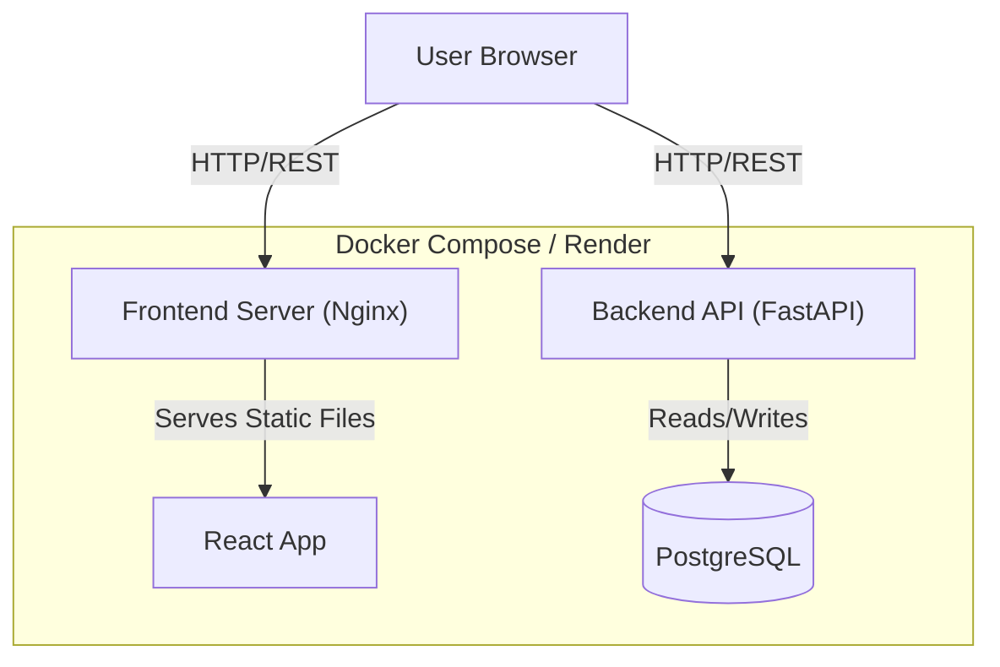

# What Now?

**What Now?** is a modern web application designed to help users make better daily decisions through structured logic and data-driven insights.


- [**Demo Video**](https://github.com/user-attachments/assets/90a97e4f-2e3a-4d17-b719-4ea9f7286056)

## The Problem
Decision fatigue is a common modern challenge. Users often struggle with paralyzed choices or lack a structured way to evaluate options for daily dilemmas. **What Now?** solves this by providing a streamlined interface to input options, apply weights, and receive logical recommendations.

## System Functionality

The application provides a robust set of features for decision assistance:

### 1. Decision Management
- **Logical Evaluation**: Input multiple options for a single decision.
- **Weighted Criteria**: Assign importance to different factors to influence the outcome.
- **History Tracking**: Keep a log of past decisions and their outcomes.

### 2. User Accounts
- **Secure Authentication**: JWT-based login and signup.
- **Personalized Data**: Each user has their own space for managing decisions.

### 3. Real-time Feedback
- **Dynamic Calculation**: Outcomes update instantly as you adjust parameters.
- **Mobile Responsive**: Access your decision tools on any device.

## System Architecture

The project is structured as a **monorepo** containing both the backend service and the frontend application.

### Architecture Diagram


### Components

#### 1. Frontend (UI Layer)
-   **Tech**: React, TypeScript, Vite, Tailwind CSS.
-   **Role**: A Single Page Application (SPA) providing a sleek, interactive decision-making interface.
-   **Communication**: Consumes the Backend REST API for all data persistence and business logic.

#### 2. Backend (Service Layer)
-   **Tech**: Python, FastAPI, SQLAlchemy, Pydantic.
-   **Role**: The core logic engine. Handles user authentication, decision algorithms, and data validation.
-   **Dependency Management**: Uses `uv` for modern, high-performance package management.

#### 3. Database (Persistence Layer)
-   **Tech**: PostgreSQL.
-   **Role**: Stores persistent data including User accounts and Decision histories.

#### 4. Infrastructure & DevOps
-   **Containerization**: Fully containerized using **Docker**.
    -   *Backend*: Optimized Python environment.
    -   *Frontend*: Efficient multi-stage build (Node -> Nginx).
-   **CI/CD**: **GitHub Actions** automates the pipeline:
    -   *Test*: Runs frontend, backend unit, and backend integration tests in separate jobs.
    -   *Deploy*: Deploys to **Render** only after all test suites pass.

## Quality Assurance & Standards

### API Contract (OpenAPI)
The **OpenAPI specification** (`openapi.yaml`) serves as the strict contract between Frontend and Backend, ensuring type safety and alignment across the stack.

### Testing
- **Frontend**: Unit and integration tests using `vitest`.
- **Backend**: Suite of unit tests using `pytest`.
- **Integration Tests**: Backend integration tests are run in a dedicated CI job to ensure system-wide stability.

## Technology Stack

### Backend
- **Language**: Python 3.11+
- **Framework**: FastAPI
- **Dependency Management**: `uv`
- **Database**: PostgreSQL (Production), SQLite (Local Dev)
- **ORM**: SQLAlchemy

### Frontend
- **Framework**: React 18
- **Language**: TypeScript
- **Build Tool**: Vite
- **Styling**: Tailwind CSS
- **Testing**: Vitest + React Testing Library

## Setup & Installation

### Prerequisites
- Python 3.11+
- Node.js 20+
- `uv`: `pip install uv`

### Backend Setup
1. `cd backend`
2. `uv sync`
3. `uv run uvicorn main:app --reload`

### Frontend Setup
1. `cd frontend`
2. `npm install`
3. `npm run dev`

## Running with Docker

```bash
docker-compose up --build
```
- **Combined URL (Frontend + Backend)**: `http://localhost:10000`
- **API Base URL**: `http://localhost:10000/api`
- **Interactive API Docs (Swagger UI)**: `http://localhost:10000/docs`

## AI-Assisted Development

This project was developed with the assistance of **Antigravity**, an advanced agentic AI coding assistant from Google Deepmind. The initial frontend was designed using **Lovable**, providing a modern and responsive UI foundation.

### Agentic Workflow
Development followed a structured agentic workflow:
1.  **Planning**: Comprehensive task breakdown using `task.md` and `implementation_plan.md`.
2.  **Execution**: Autonomous code modification, file management, and system integration.
3.  **Verification**: Continuous validation through automated tests and manual checks.
